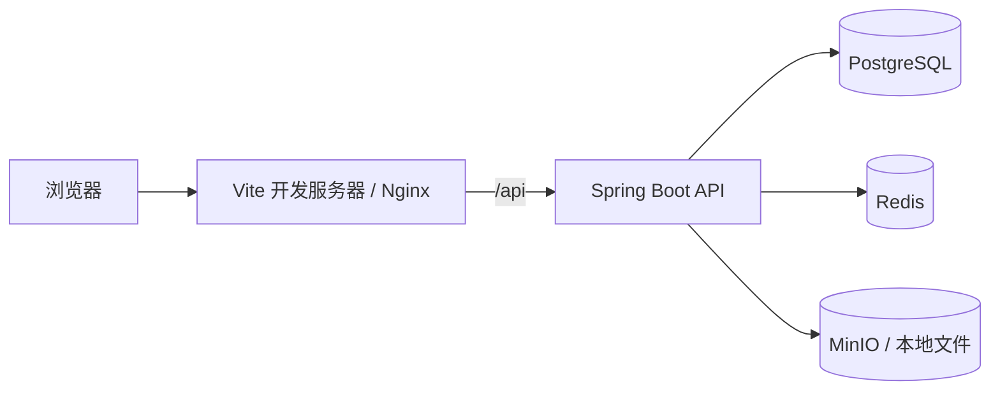

# Nova Admin

Nova Admin 是一个可直接运行的企业级 RBAC 后台管理系统模板，提供用户、角色、部门、菜单、接口权限、数据权限、字典、文件、定时任务、审计日志、通知和系统设置等通用能力。

项目采用前后端分离架构，支持本地开发和 Docker 生产部署，适合作为内部管理平台基础、SaaS 管理端或业务系统后台底座。

## 功能概览

| 模块 | 能力 |
|---|---|
| 工作台 | 系统规模、活动趋势、运行资源、在线用户和最近动态 |
| 认证与会话 | JWT、服务端会话、验证码、登录失败锁定、Token 刷新、设备会话管理 |
| 用户管理 | 用户增删改查、启停用、重置密码、Excel 导入/导出 |
| 组织权限 | 部门树、角色、菜单、按钮权限、接口权限发现和多主体授权 |
| 数据权限 | 全部、本部门及下级、本部门、本人、自定义部门等范围 |
| 字典与配置 | 字典类型/数据、站点信息、安全策略、上传策略、公告 |
| 文件中心 | 本地磁盘或 MinIO 存储、预览、下载和删除 |
| 任务中心 | CRON 定时任务、手动执行、并发控制、执行历史和失败通知 |
| 审计 | 操作日志、登录日志、敏感字段脱敏和按保留期限清理 |
| 通知 | 站内通知、SSE 实时刷新、草稿、定时发布、送达明细和已读状态 |

## 技术栈

### 后端

- Java 25
- Spring Boot 4.1
- Spring Security 7.1 + JJWT
- MyBatis-Plus 3.5.15
- PostgreSQL 17
- Redis 8 + Redisson
- MinIO
- Springdoc OpenAPI

### 前端

- React 19 + TypeScript 7
- Vite 8
- Ant Design 6 + ProComponents 3
- Tailwind CSS 4
- Zustand 5
- TanStack Query 5
- pnpm

## 架构



后端按模块和分层组织：

```text
Controller -> Service -> Mapper -> Database / Redis / Object Storage
```

## 运行要求

本地开发需要：

- macOS、Linux 或 Windows WSL2
- Docker 24+ 和 Docker Compose v2
- Java 25
- Maven 3.9+
- Node.js >= 20.19
- pnpm

macOS 推荐使用 OrbStack，也可以使用 Docker Desktop。

## 快速开始

### 1. 获取代码

```bash
git clone <repository-url> nova-admin
cd nova-admin
```

### 2. 启动基础设施

本地 Compose 会启动 PostgreSQL、Redis、MinIO，并在 PostgreSQL 首次创建数据目录时自动执行 `nova-admin-backend/sql/init.sql`。

```bash
# macOS 使用 OrbStack 时执行；Docker Desktop 可跳过
orb start

docker compose up -d
docker compose ps
```

本地服务：

| 服务 | 地址 | 默认凭据 |
|---|---|---|
| PostgreSQL | `localhost:5432` | `nova` / `nova_pass_2026` |
| Redis | `localhost:6379` | `nova_redis_2026` |
| MinIO API | `http://localhost:9000` | `nova_minio` / `nova_minio_2026` |
| MinIO Console | `http://localhost:9001` | `nova_minio` / `nova_minio_2026` |

### 3. 启动后端

```bash
cd nova-admin-backend
mvn spring-boot:run
```

后端默认使用 `dev` profile：

- API 根地址：`http://localhost:8080/api`
- Swagger UI：`http://localhost:8080/api/swagger-ui.html`
- OpenAPI JSON：`http://localhost:8080/api/v3/api-docs`
- 健康检查：`http://localhost:8080/api/actuator/health`

### 4. 启动前端

另开一个终端：

```bash
cd nova-admin-frontend
pnpm install
pnpm dev
```

访问 `http://localhost:5173`。Vite 会将 `/api` 代理到 `http://localhost:8080`。

## 演示账号

初始化脚本中的演示账号密码均为 `123456`。开发环境默认启用验证码，登录时需要填写页面显示的验证码。

| 账号 | 角色 | 数据范围 |
|---|---|---|
| `superAdmin` | 超级管理员 | 全部权限 |
| `admin` | 管理员 | 全部菜单权限 |
| `liwei` | 平台管理员 | 研发中心及下级 |
| `zhangyan` | 人事管理员 | 人力资源部 |
| `wangqiang` | 审计专员 | 全部数据的只读菜单 |
| `chenxi` | 运营专员 | 运营中心和客户成功部 |
| `xiaomei` | 普通用户 | 本人 |

生产环境必须修改所有默认密码、数据库密码、Redis 密码、MinIO 凭据和 JWT Secret。

## 开发命令

### 后端

```bash
cd nova-admin-backend

# 启动开发服务
mvn spring-boot:run

# 编译并打包
mvn package

# 直接运行打包产物
java -jar target/nova-admin-backend.jar
```

### 前端

```bash
cd nova-admin-frontend

pnpm install       # 安装依赖
pnpm dev           # 开发服务器
pnpm type-check    # TypeScript 检查
pnpm build         # 生产构建
pnpm preview       # 预览 dist
pnpm format        # Prettier + Tailwind 类名排序
pnpm lint          # ESLint；当前仓库需先完成 ESLint 9 flat config 迁移
pnpm gen:icons     # 重新生成 Ant Design 图标目录
```

## 配置

### 后端 Profile

- `application.yml`：通用配置、端口、context-path、文件存储和 OpenAPI。
- `application-dev.yml`：本地 PostgreSQL、Redis 连接和 DEBUG 日志。
- `application-prod.yml`：生产数据库、Redis 和日志配置，敏感值从环境变量读取。

后端默认：

```text
server.port=8080
server.servlet.context-path=/api
spring.profiles.active=dev
```

### 生产环境变量

生产 Compose 已使用的变量：

| 变量 | 说明 |
|---|---|
| `NOVA_DB_URL` | PostgreSQL JDBC 地址 |
| `NOVA_DB_USER` | PostgreSQL 用户 |
| `NOVA_DB_PASSWORD` | PostgreSQL 密码 |
| `NOVA_REDIS_HOST` | Redis 主机 |
| `NOVA_REDIS_PORT` | Redis 端口，默认 6379 |
| `NOVA_REDIS_PASSWORD` | Redis 密码 |
| `NOVA_JWT_SECRET` | JWT 签名密钥，生产必填 |
| `MINIO_ROOT_USER` | MinIO 管理员账号 |
| `MINIO_ROOT_PASSWORD` | MinIO 管理员密码 |

生成 JWT Secret：

```bash
openssl rand -base64 48
```

生产后端容器访问 MinIO 时，必须将 MinIO endpoint 配置为容器网络地址（例如 `http://minio:9000`），不要使用后端容器内的 `localhost`。可以通过生产 Compose 的 `backend.environment` 注入对应的 `NOVA_FILE_MINIO_*` 配置。

### 前端环境变量

开发和生产示例分别位于 `nova-admin-frontend/.env.development` 与 `.env.production`：

```dotenv
VITE_APP_TITLE=Nova Admin
VITE_API_BASE_URL=/api
VITE_APP_ENV=development
```

前端通过 `/api` 相对路径访问后端，生产环境由 Nginx 反向代理。

## 数据库与文件服务

### 初始化机制

`docker-compose.yml` 将 `sql/init.sql` 挂载到 PostgreSQL 的 `docker-entrypoint-initdb.d`。该脚本只在 PostgreSQL 数据目录首次为空时自动执行；修改脚本不会自动覆盖已有数据。

### 重置本地开发数据

以下命令会删除本地 PostgreSQL、Redis 和 MinIO 的全部数据，只适用于本地开发环境：

```bash
docker compose down
rm -rf .docker-data/postgres .docker-data/redis .docker-data/minio
docker compose up -d
```

确认初始化结果：

```bash
docker compose exec postgres psql -U nova -d nova_admin
```

```sql
SELECT count(*) FROM sys_user;
SELECT count(*) FROM sys_role;
SELECT count(*) FROM sys_menu;
```

### 文件存储

默认上传策略为 MinIO，bucket 为 `nova-admin`。系统也支持在「系统设置」中切换到本地磁盘：

- MinIO：开发环境使用 `http://localhost:9000`，生产环境使用 Compose 服务名访问。
- 本地磁盘：默认目录为 `${user.home}/nova-admin/upload`。
- 文件预览统一通过 `/api/file/preview/**`，前端不直接拼接物理存储路径。

## 调试指南

### 查看容器状态和日志

```bash
docker compose ps
docker compose logs -f postgres
docker compose logs -f redis
docker compose logs -f minio
```

### 后端调试

开发 profile 会输出：

- `root=INFO`
- `com.nova.admin=DEBUG`
- `org.springframework.security=INFO`
- `com.baomidou.mybatisplus=WARN`

重点检查：

1. 后端启动时 PostgreSQL 是否可连接；
2. Redis 密码是否与 `application-dev.yml` 一致；
3. MinIO endpoint、bucket 和凭据是否可用；
4. 请求是否包含 `Authorization: Bearer <access-token>`；
5. 业务错误是否返回 `R<T>`，权限失败是否为 HTTP 403。

### API 调试

优先使用 Swagger UI 查看请求模型、权限注解和响应结构。浏览器开发者工具中检查：

- `/api/auth/login` 是否成功；
- `/api/auth/session-events` 是否保持 SSE 连接；
- `/api/system/user/page` 等列表请求的分页参数；
- 401 是否触发重新登录，403 是否显示权限不足；
- 文件预览请求是否走 `/api/file/preview/`。

### 前端调试

```bash
cd nova-admin-frontend
pnpm type-check
pnpm build
```

如果前端无法访问接口：

1. 确认后端运行在 8080 端口；
2. 确认 Vite 代理配置仍指向 `http://localhost:8080`；
3. 检查浏览器 Network 中实际请求是否以 `/api` 开头；
4. 清理浏览器的 `localStorage` 后重新登录；
5. 检查登录用户是否拥有对应菜单和接口权限。

如果 Logo、主题或语言没有更新，刷新系统设置查询并清理浏览器缓存；系统配置保存在 `sys_config`，不是前端环境变量。

## 生产部署

### 1. 准备环境变量

在项目根目录准备 `.env`，至少设置生产数据库、Redis 和 JWT Secret。`.env` 不应提交到 Git。

### 2. 构建镜像

```bash
docker compose -f docker-compose.prod.yml build
```

后端镜像使用 Maven 3.9 + Eclipse Temurin JDK 25 构建，运行阶段使用 JRE；前端镜像使用 Node 22 构建并由 Nginx 1.27 托管。

### 3. 启动服务

```bash
docker compose -f docker-compose.prod.yml up -d
docker compose -f docker-compose.prod.yml ps
```

生产访问入口：

- 前端：`http://<host>/`
- API：`http://<host>/api/...`
- Swagger：`http://<host>/api/swagger-ui.html`

Nginx 已配置 SPA 路由回退、`/api/` 反向代理、100 MB 上传限制和 120 秒 API 读取超时。正式环境应在 Nginx 或云负载均衡层终止 HTTPS。

### 4. 运维命令

```bash
docker compose -f docker-compose.prod.yml logs -f backend
docker compose -f docker-compose.prod.yml logs -f frontend
docker compose -f docker-compose.prod.yml restart backend
docker compose -f docker-compose.prod.yml down
```

生产 PostgreSQL、Redis、MinIO 使用命名卷，`down` 不会自动删除数据；删除卷前必须确认备份和恢复方案。

## 项目结构

```text
nova-admin/
├── AGENTS.md                         # AI 编程入口和规则导航
├── README.md                         # 唯一完整项目说明
├── docker-compose.yml                # 本地 PostgreSQL / Redis / MinIO
├── docker-compose.prod.yml           # 生产后端、前端和基础设施
├── docs/
│   ├── deployment.md                 # 部署补充说明
│   ├── rules/                        # 分类开发规则
│   └── ...                            # 其他项目文档
├── nova-admin-backend/
│   ├── src/main/java/com/nova/admin/
│   │   ├── common/                   # 响应、异常、审计、基础能力
│   │   ├── config/                   # Spring 配置
│   │   ├── modules/                  # auth/system/dashboard/job/monitor/infra
│   │   └── security/                 # JWT、会话和安全工具
│   ├── src/main/resources/           # YAML、i18n、Mapper XML
│   ├── sql/init.sql                  # 全量建表和初始化数据
│   ├── Dockerfile
│   └── pom.xml
└── nova-admin-frontend/
    ├── src/api/                      # API 请求层
    ├── src/components/               # 跨页面组件
    ├── src/hooks/                    # 通用 Hook
    ├── src/i18n/                     # 中英文文案
    ├── src/layouts/                  # ProLayout 布局
    ├── src/pages/                    # 页面模块
    ├── src/stores/                   # Zustand 客户端状态
    ├── src/styles/                   # Tailwind 和 CSS Modules
    ├── src/utils/                    # 请求、树、展示等工具
    ├── Dockerfile
    ├── nginx.conf
    └── package.json
```

## 开发规则

规则按主题拆分在 [`docs/rules/`](docs/rules/)：

- [项目级规则](docs/rules/00-project.md)
- [后端开发规则](docs/rules/10-backend.md)
- [前端开发规则](docs/rules/20-frontend.md)
- [组件与页面布局规则](docs/rules/30-components.md)
- [API 与数据契约规则](docs/rules/40-api.md)
- [交付与协作规则](docs/rules/50-delivery.md)

部署细节见 [`docs/deployment.md`](docs/deployment.md)。

## 许可证

MIT
